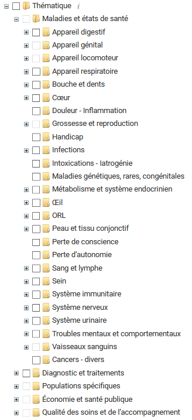

# Exercice NLP

Ce dépôt propose un exercice ouvert de traitement du langage naturel (NLP), à partir d'un problème fictif sur les publications de la HAS.

## Problématique métier (FICTIVE !)

Les publications de la HAS sont catégorisées selon divers thématiques, pour permettre la navigation sur le site internet.



Cette catégorisation prend beaucoup de temps aux documentalistes, qui aimeraient automatiser cette tache, en particulier pour les catégorie de la thématique `Maladies et états de santé` qui sont les plus difficiles.

L'équipe data a proposé d'étudier une fonctionnalité d'assistance à la catégorisation, qui serait intégré à l'interface d'administration du site.

## Données

## Thématiques

Les thématiques sont décrites dans le document `documentation/categories_thematiques.xlsx`

Elles sont organisées selon une arborescence, que l'on peut reconstruire via l'identifiant du parent.

On peut également interroger dynamiquement cette arborescence par API (point d'API `https://www.has-sante.fr/rest/data/children/{id}`, cf section dédiée plus bas).

### Types de contenus

Les contenus du site de la HAS ont un type, parmi une liste donnée dans le document `documentation/type_contenus.xlsx`. 
Ce document donne également le nom interne (technique) d'un type.

On peut également retrouver ces informations par API  `https://www.has-sante.fr/rest/types` (cf section dédiée plus bas).


On s'interessera en particulier à catégoriser les documents des types suivants

- Evaluation des technologies de santé
- Recommandation de bonne pratique
- Guide maladie chronique
- Recommandation en santé publique
- Guide usagers
- Recommandation vaccinale
- Avis sur les Médicaments
- Avis sur les dispositifs médicaux et autres produits de santé
- Synthèse d'avis et Fiche bon usage

Pour effectuer la classification, on s'interrera en priorité au résumé htlm des publications, disponible dans le champ `resume` (ou parfois `objectifs`), plutôt qu'aux documents pdf joints (ce qui nécessiterait plus de travail).

### Accès API

Le site de la HAS est basée sur la plateforme Jalios, qui fonctionne comme un store XML.
Chaque objet du store (publication, catégorie, etc) a un identifiant et des attributs.

Il est possible de l'interroger par API, décrite de façon générique dans [ce document](https://community.jalios.com/jcms/jx_59631/fr/services-web-restful-avec-jcms-open-api).


#### Points d'API

Le principal point d'API utile dans l'exercice est 
`https://www.has-sante.fr/rest/data/{param}`, qui permet de 
- récupérer un objet si le paramètre est un identifiant (https://has-sante.fr/rest/data/p_3240117)
- récupérer l'ensemble des objets d'un type particulier, si le paramètre est un type de données (https://www.has-sante.fr/rest/data/RecommandationVaccinale)


Autres points d'API a priori inutiles pour l'exercice

`https://www.has-sante.fr/rest/search` permet d'effectuer une recherche avec des paramètres


On peut télécharger les documents et images référencés dans les objets, en ajoutant l'url du site devant. 
Par exemple https://www.has-sante.fr/upload/docs/application/pdf/2021-03/strategie_de_vaccination_contre_le_sars-cov-2__extension_des_competences_vaccinales_des_professionnels_de_sante.pdf

#### Paramètres d'API

L'API accepte des paramètres, qui peuvent être passés encodés dans l'url après un `?` et séparés par des `&`.

En voici quelques uns, sans être exhaustifs.

On peut naviguer dans les résultats d'une collection paginée avec les paramètres
- `start` : début de la page
- `pageSize` : taille de la page
- `sort` : paramètre de tri
- `reverse` : inverse ordre du tri

Exemple : https://www.has-sante.fr/rest/data/RecommandationVaccinale?start=0&pageSize=2&sort=pdate&reverse=false

On peut effectuer une recherche avec les paramètres suivants
- `text` : texte de recherche 
- `types` : liste de types pour préciser la recherche
- et autres à [tester dans cette requête](https://www.has-sante.fr/rest/search?text=&mode=all&searchedAllFields=true&catName=true&exactCat=false&catMode=and&cids=&dateType=cdate&dateSince=0&dateSince_user=0&dateSince_unit=1&beginDateStr=&endDateStr=&exactType=false&replaceFileDoc=false&types=generated.EvaluationDesTechnologiesDeSante&types=generated.GuideMedecinALD&mids=&midsChooserDisplay=&mids=&gidsChooserDisplay=&gids=&pstatus=0&pstatus=&pstatus=&langs=&wrkspcChooserDisplay=&wrkspc=&searchInSubWorkspaces=false&wrkspc=)

### Résultatas en json

Par défaut, l'API envoie une réponse au format XML.

Il est possible d'obtenir une réponse au format json, en indiquant `application/json` dans l'en-tête `Accept`.
La réponse en json peut être plus simple à manipuler. 
En revanche elle est plus pauvre que la réponse XML, notamment seulement l'identifiant des catégories est renvoyé, sans leur nom.

Exemple de requête Python

```python
import requests
r = requests.get("https://www.has-sante.fr/rest/data/RecommandationVaccinale", 
                 headers={"accept": "application/json"})
r.json()
```


## Exercice

L'exercice consiste à travailler sur cette fonctionnalité d'assistance fictive.

Différentes étapes pourront être développées :
- Décrire une démarche de travail
- Acquisition et nettoyage des données
- Définition de métrique de succès
- Entraînement de modèles 
- Restitution des résultats
- Description de l'architecture de la solution envisagée

## Production

L'exercice sera développé sur un fork de ce dépôt.

- Les documents descriptifs seront rédigé au format Markdown.
- Le principal langage à utiliser est Python pour le traitement de données. Les codes seront versionnés dans le dépôt (librairie `.py` et/ou notebook `.ipynb`).
- Les résultats pourront être présentés dans des notebooks, ou autre format de restitution au choix.

- La gestion des données et modèles est laissée libre.

## Disclaimer

Ce problème est potentiellement difficile et chronophage. 

Nous **n'attendons pas** de solution complète ou très performante.

Il sera bienvenu de simplifier le problème, pour s'attacher à un sous-problème plus simple.

Nous nous intéresserons à la démarche générale, et aux compétences techniques et scientifiques sur le traitements de données et l'usage de librairies de NLP.

